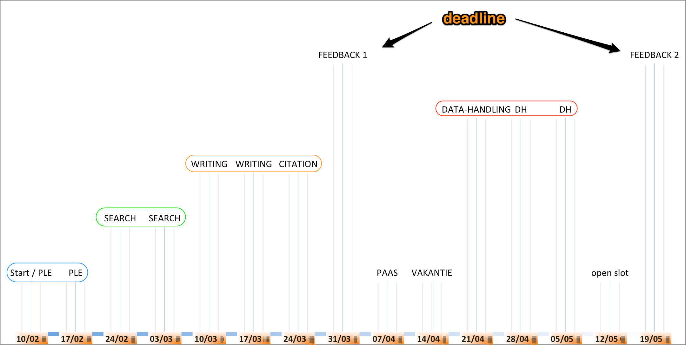

# Syllabus

1. 10/2/15 [Intro, PLE 1](./ency15-1_inleiding_ple.md) 
2. 17/2/15 [PLE 2](./ency15-2_ple.md)
3. 24/2/15 [Search](./ency15-3_search.md)
4. 03/3/15 [Search2 Databanks](./ency15-4_search2.md)
5. 10/3/15 [Writing](./ency15-5_writing.md)
6. 17/3/15 [Writing2](./ency15-6_writing2.md)
7. 24/3/15 [Citation](./ency15-7_citation.md)
8. 31/3/15 [Feedback / LSIN](./ency15-8_feedback_lsin.md) 
9. 21/4/15  [Data Handling & Structured Text: concepts and readings](ency15-9_data-handling_concepts.md)
10. 28/4/15 [Structured Text, sustainable authorship, textconversion](ency15-10_structured_texts.md)
11. 05/5/15 [Data Handling: text analysis, structured data sets](ency15-11_data-handling_text_analysis.md)
12. 12/5/15 [Data Handling: webscraping](ency15-12_data-handling_webscraping.md) / [the PLE revisited](ency15-12_ple_revisited.md)
13. 19/5/15 [Feedback 2](ency15-13_feedback.md)