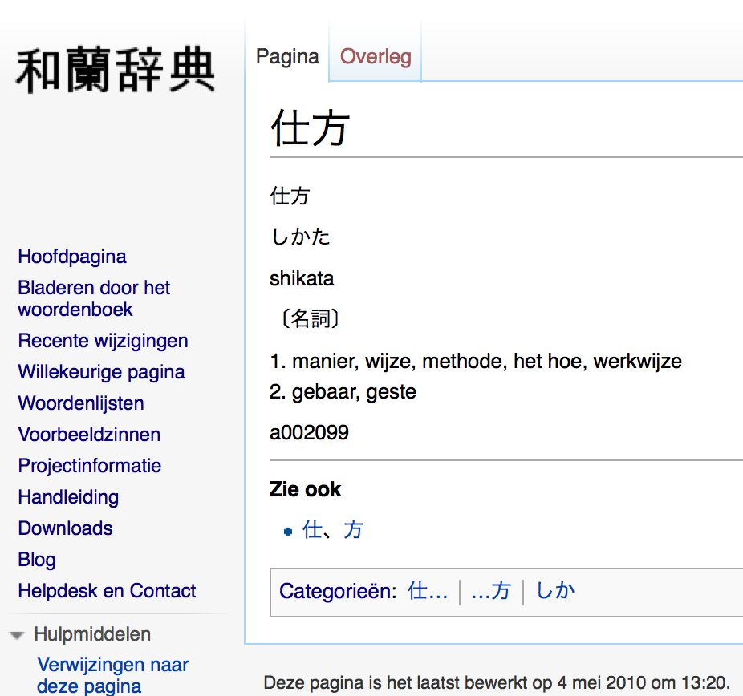
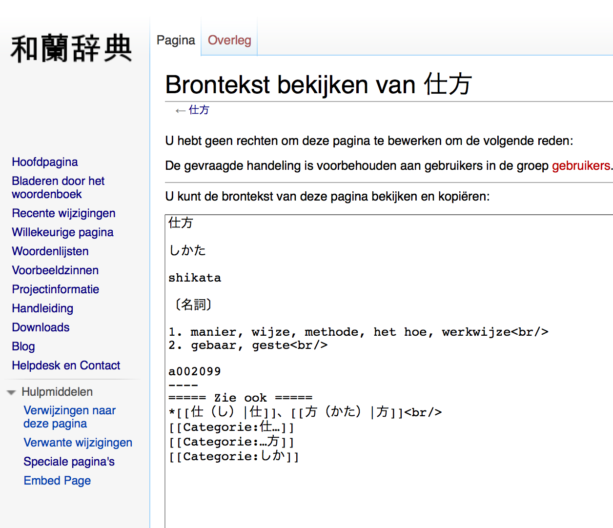
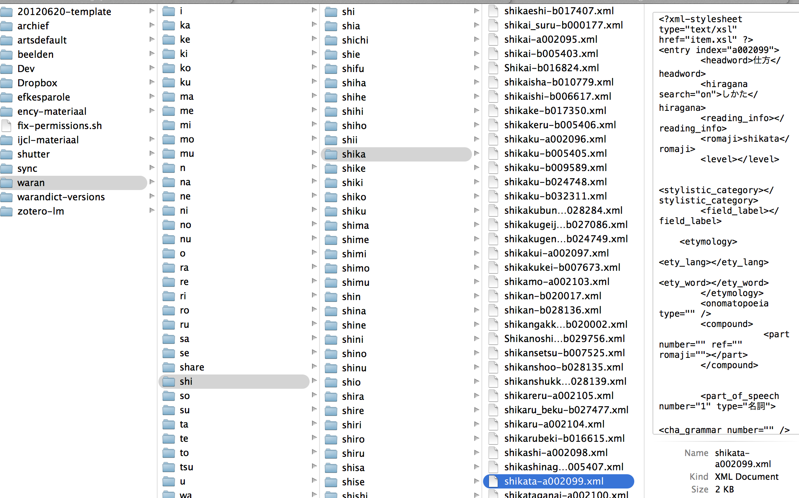
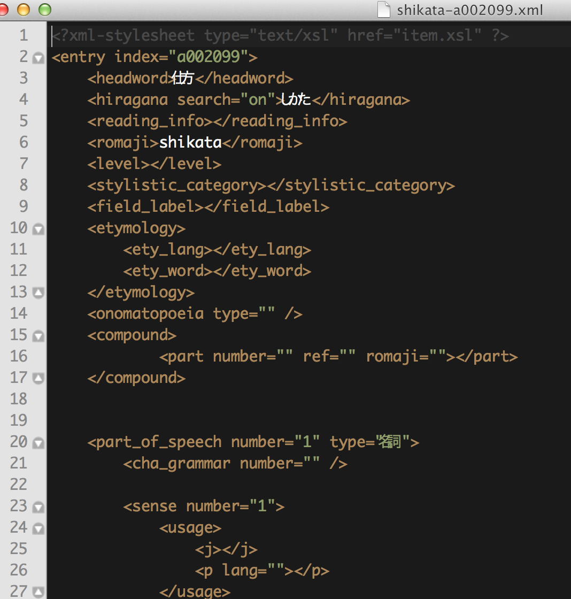
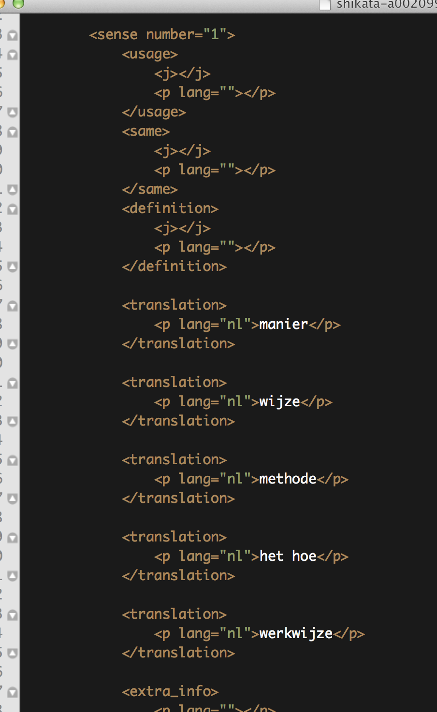
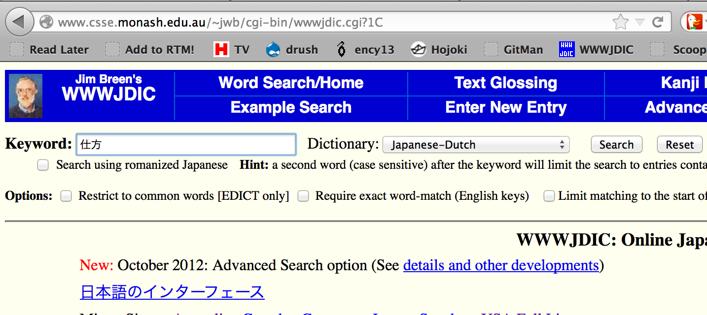
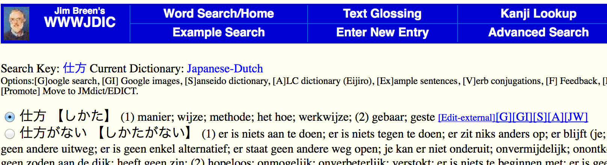
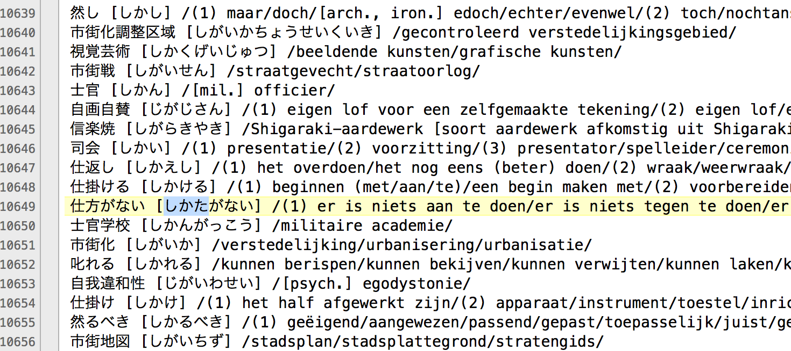

Webschrapen en visualiseren van data
====================================

## Parafraseren data-handling

Draad oppikken met audio-probleempje vorige week: (http://openrefine.org/), 2de filmpje "Clean and transform data". 

## Webscraping

Data die niet in databases zit van het web halen en verwerken. __Zoeken naar structuur__. 

### Voorbeeld waranwiki scraper. 

### Browsersextensies

Voorbeeld [outwit hub](https://www.outwit.com/products/hub/) of [chromescraper](https://chrome.google.com/webstore/detail/scraper/mbigbapnjcgaffohmbkdlecaccepngjd).

### Scraping for journalists

Bradshaw, Paul. 2012. _Scraping for Journalists_. Leanpub. http://leanpub.com/scrapingforjournalists.

!(../beelden/scrapingforjournalists.png)

Extracting individual lists or tables from single webpages: [A quick guide on web scraping](http://www.mulinblog.com/quick-guide-web-scraping/)

Lin, Mu. 2014. “Teaching Data Visualization: Recommended Readings and Resources.” http://www.mulinblog.com/teaching-data-visualization-recommended-readings-and-resources/.

## Visualiseren data

1. find data (cfr vorige sessie)
2. clean data: bijvoorbeeld met [OpenRefine](http://openrefine.org/)
3. process data: bijvoorbeeld met [Yahoo Pipes](http://pipes.yahoo.com/pipes/)
4. publish data: bijvoorbeeld met [Gephi](http://gephi.org/) of [tableau](https://www.tableau.com)
5. [Overzicht soorten visualisaties](http://hci.stanford.edu/jheer/files/zoo/)

## Oefeningen

1. [Scraping for journalists](https://leanpub.com/scrapingforjournalists): download het sample hoofdstuk en maak de scraper die er in beschreven staat na.
2. Gebruik outwit hub of [chromescraper](https://chrome.google.com/webstore/detail/scraper/mbigbapnjcgaffohmbkdlecaccepngjd) om een wikipedia pagina met tabellen om te zetten naar een csv-bestand.