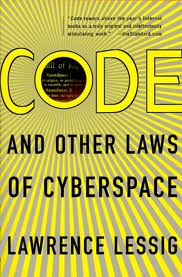

PLE revisited
=============

Wat heeft coderen met een PLE te maken?

## "Coderen"

[Code is law](https://www.socialtext.net/codev2/Code%20Is%20Law)

## How to be a hacker!

1. een oog voor structuur
2. de kunst om op schouders van reuzen te staan
3. durven proberen en uittesten tot het goed is

(Uit: Scraping for Journalists,  The final chapter: _where do you go from here?_  )

= eigenlijk:

een andere definitie van het concept "leren"

## Portfolio

- belangrijk onderdeel PLE
- complementair met diploma
- valoriseren Japanjaar
- functies:
    - showcase
    - process 
    - bewustwording competenties

### Oefeningen

- teken je ideale portfolio
- welke aktiviteiten zou je opnemen?
- zou je de onderdelen van je portfolio graag door de universiteit geattesteerd zien. Zo ja, op welke manier?
- embed je geschiedenis-wikiartikel door een stukje code aan een 'portfolio-post' toe te voegen. Plak onderstaande snippet in het veld 'embed post'. 

``

Niet vergeten om de portfoliopost op te slaan.

- hoe zou je de paper politiek opnemen in je portfolio? Doe maar.
- zijn er nog andere werkstukken die in je portfolio horen? 