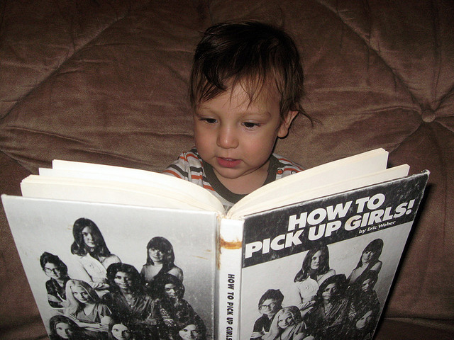
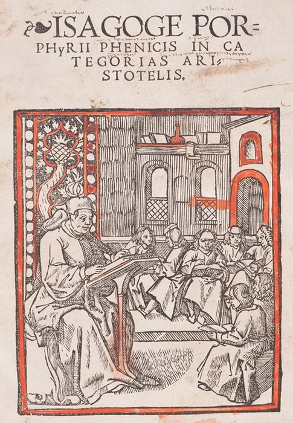
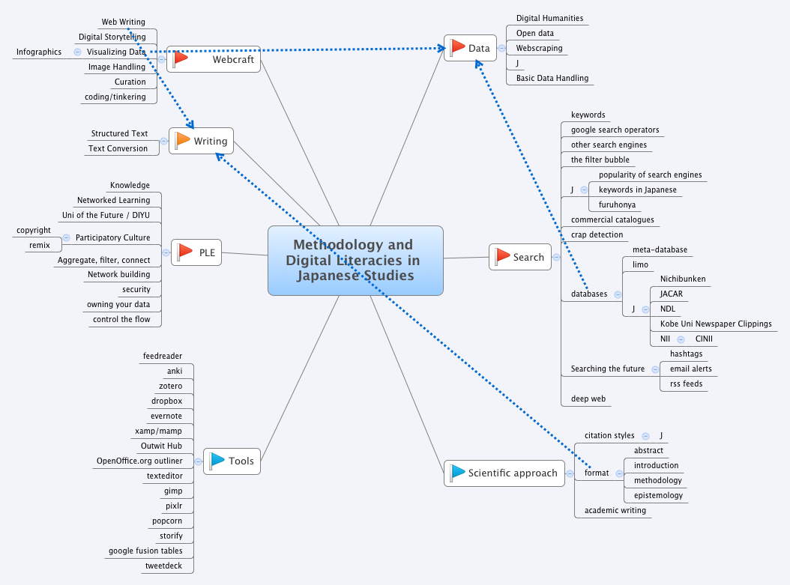
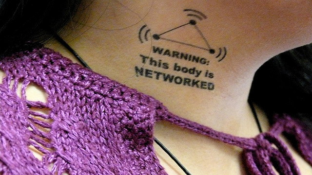
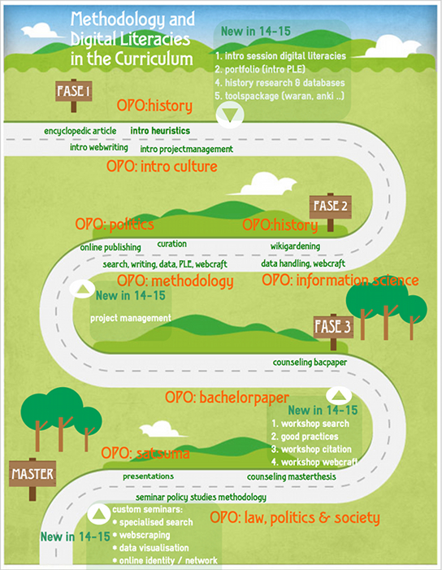
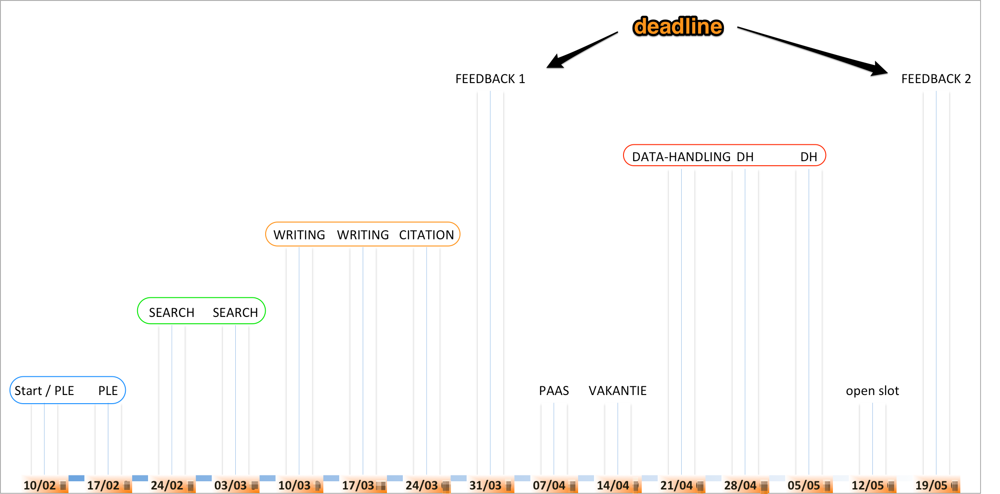

# Methodologie en digitale geletterdheid - Inleiding

## onderwijsproject 'the future self'

* identiteitsbevorderend onderwijs
* eigenheid vinden binnen veranderend leren
* op eigen benen staan: je identiteit als student online uitwerken, privacy beschermen, <em>owning your data</em>
* helpen om autonome en genetwerkte kenniswerkers te vormen
* zelfsturing (<em>empowerment</em>) door digitale geletterdheid

### Digitale geletterdheid って言うのは？

### Basisaanname 1: internet = game changer

Alleen al door het opheffen van schaarste. 

### Basisaanname 2: zelfsturing door digitale geletterdheid 

    Handling abundance requires other skillsets than handling scarcity.

### Accenten

* nadruk op transversale: per definitie curriculumwijd
* generieke informatievaardigheden
* netwerk gericht <!-- voorbeeld bacpaper -->
* individuele student als vertrekpunt

### Individuele student als vertrekpunt: PLWO 

Concrete inhoud persoonlijke leer- en werkomgeving ('PLWO' of PLE) uitwerken: 

     PLWO = attitude + netwerk + tools

#### attitude
* diepe scepsis ten opzichte van alles wat je online tegen komt - de kritische reflex, zelfreflectie, onafhankelijkheid
* kennisverantwoordelijkheid
* _digital resilience_ 
* een hacker mentaliteit:
    1. een oog voor structuur (= gestructureerde tekst)
    2. de kunst om op schouders van reuzen te staan
    3. durven proberen en uittesten tot het goed is 
* wegsturen van consumptiepatronen - tijdens studies … en verder?
    * andere kijk op het curriculum:

#### netwerk

* portfolio - maak je werk zichtbaar / vindbaar
* online security
* JIT learning - kennis in het netwerk
* picking a social network
* "A domain of one's own" 

>One of the most powerful things that you can do on the Web is to be a node in a network of learners, and to do so most fully and radically, I dare say, you must own your own domain. [Audrey Watters]

#### tools 

per definitie een snapshot, essentie is samenstellen en onderhouden van eigen toolbox ('software kritiek')  

## Concreet

### Op Toledo

* spreadsheet gegevens deelnemers - invullen
* toelichting evaluatie & examen
* matome #ency14 (eindtermen)
* links naar al de rest

### timeline

### maken

1. blog - reflectie
2. geannoteerde bibliografie

### weblocaties

* [archief 2002~ (lab)](http://japanologie.arts.kuleuven.be/lab/geannoteerde-bibliografieën)
* [bibliografie / leeslijst (zotero)](https://www.zotero.org/groups/japanese_studies_kuleuven/items/collectionKey/EX4C7JQG)
* portfolio's & individuele oefeningen(lab)
* syllabus (github)
* hashtag #ency15 
* toledo (cfr. supra)

### bachelorproject

* toegepaste japanologie 
* schrijfbaarheid

## PLE must-haves

* eigen domeinnaam
* backup strategie
* social media strategie (filter bubble ed. inbegrepen)
* toolset (aggregate, remix/filter, share)

## PLE basaal

professioneel omgaan met informatie

### file system

- [Are those files really final?](http://chronicle.com/blogs/profhacker/final-files/58875)
- [Naming conventions](http://chronicle.com/blogs/profhacker/naming-conventions-good-for-faculty-and-students-alike/35467)
- [Organizing drafts](http://protoscholar.com/2011/03/10/organizing-drafts/)

### back-up

- [informatiewijzer.be](http://www.informatiewijzer.be/inhoudstafel)
- [A simple object lesson…](http://protoscholar.com/2011/04/17/a-simple-object-lesson/)
- [Backups are one of your most important tasks…](http://protoscholar.com/2009/07/12/backups-are-one-of-your-most-important-tasks/)

### git

- [Youtube: Version control systems, Git basics](https://www.youtube.com/watch?v=8oRjP8yj2Wo&list=PLg7s6cbtAD165JTRsXh8ofwRw0PqUnkVH)
- [Why version control](http://betterexplained.com/articles/a-visual-guide-to-version-control/)
- [Pro Git book](http://www.git-scm.com/book/en/v2)
- [trygit](http://try.github.io/levels/1/challenges/1)
- [Git immersion](http://gitimmersion.com/lab_01.html)
- [Using Dropbox as a Private GitHub - Jimmy Theis](http://jetheis.com/blog/2013/02/17/using-dropbox-as-a-private-github/)

## tegen volgende week

1. een account aanmaken op feedly.com
2. installeer een tekst editor
2. reflectie oefening git
3. __project, onderzoeksthema__ posten tegen uiterlijk zaterdag 14/2, middernacht 

