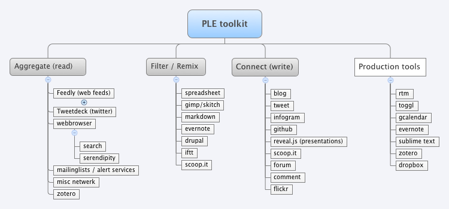

# Ency15-2 PLE

## Kort

### git demo

Demonstratie van git en github.

### Henry Jenkins

Korte duiding van het werk van [Henry Jenkins](http://henryjenkins.org/), met name het concept _[prosuming](https://en.wikipedia.org/wiki/Participatory_culture)_ 

>Here, literacy is understood to include not simply what we can do with printed matter but also what we can do with media. Just as we would not traditionally assume that someone is literate if they can read but not write, we should not assume that someone possesses media literacy if they can consume but not express themselves. -- Henry Jenkins

### ency15 hashtag

[automatisch twitter archief](http://hawksey.info/tagsexplorer/arc.html?key=1lld0_I_Nb2W8zdovmpcpBJ90vJ-8zP99IA8YFBJOpFc&gid=400689247). Het gebruik van twitter is niet verplicht voor dit OPO maar studenten worden aangemoedigd om ook via dit kanaal relevant materiaal te delen, vragen te stellen en sarcastische commentaren over de docenten de wereld in te sturen.

## PLE

### Omgaan met de informatiestroom: Aggregate, Filter/Remix, Connect

> We have to view information as a flow rather than as a thing. Online learning is a flow. It’s like electricity or water. It’s there, it’s available and it flows. It’s not stuff you collect. I don’t see myself sitting in my home collecting jars of water. I use the water as it comes. -- Stephen Downes

Voorbeeld van een verzameling tools voor de PLE:

#### Leestip: 
- Kastelle, Tim. 2010. “Personal Aggregate, Filter & Connect Strategies.” January 26. [http://timkastelle.org/blog/2010/01/personal-aggregate-filter-connect-strategies/](http://timkastelle.org/blog/2010/01/personal-aggregate-filter-connect-strategies/).

- Ismael Peña-López. 2010. “The Workings of a Personal Learning Environment (II): The Information Workflow.” _ICTlogy_. August 6. [http://ictlogy.net/20100806-the-workings-of-a-personal-learning-environment-the-information-workflow/](http://ictlogy.net/20100806-the-workings-of-a-personal-learning-environment-the-information-workflow/).

### Feedly

- Het zelf samenstellen van een verzameling webfeeds is een basisvaardigheid, must voor elke kenniswerker. Even belangrijk zijn een hiërarchie in de feeds aan te brengen en de gewoonte aankweken om de belangrijkste feeds regelmatig te lezen.
- Een voorbeeld van een feedly-collectie voor professioneel gebruik
- Japanese Studies opml bestand (op Toledo - Course information folder). 
    - Opdracht 1:
        - download het bestand en open het in je teksteditor
        - bekijk goed de structuur en maak een nota van je indruk, bedenkingen en vragen. We komen hierop terug binnen een paar weken, wanneer we het over gestructureerde tekst hebben
    -  Opdracht 2: importeer het opml bestand in je feedly account
    -  Opdracht 3: vul je feed collectie aan met rss-feeds met algemeen nieuws over Japan en indien mogelijk met sites die te maken hebben met je onderzoeksonderwerp (aan te vullen in de loop van je onderzoek). Maak relevante categorieën aan.
    -  Wat zit er niet in het opml-bestand:
        +  hashtag #ency15 feed (probleem: twitter API)
        +  commit feed ency github repo (probleem: feed heeft alle repo's)
        +  feed japanologie lab (probleem: feedly ondersteunt geen feeds die achter een paswoord zitten)

### Voorbeeld van een PLE in functie van een doctoraatsonderzoek

15' presentatie door collega Nele Noppe

#### Leestip
Clifford, Miriam. 2013. “20 Tips for Creating a Professional Learning Network.” Getting Smart. January 17. [http://gettingsmart.com/2013/01/20-tips-for-creating-a-professional-learning-network/](http://gettingsmart.com/2013/01/20-tips-for-creating-a-professional-learning-network).

## Feedback onderzoeksthema's

We verdelen ons in 4 groepen om de ingediende voorstellen te bespreken en te beoordelen op schrijfbaarheid (rekenblad op Toledo). 

## Voorbereiding volgende sessie (ency15-3. Search. 24/2/15)

1. Installeer [zotero](http://zotero.org) als extensie voor firefox of alleenstaande applicatie.
2. We houden ons in sessie 3 exclusief bezig met oefeningen op zoekmachines. Neem in functie daarvan de [pdf](http://hanscoppens.net/sites/minami.hanscoppens.net/files/uploads/attachments/20141007-geschiedenis_search.pdf) grondig door die we in het kader van het OPO Geschiedenis van Japan op 7/10/2014 hebben samengesteld. Vooral het hoofdstuk "Better Search", paragraaf 1,2 en 3 zijn noodzakelijk als voorbereiding. Zorg ook dat je deze info bij de hand hebt tijdens het maken van de oefeningen. 

