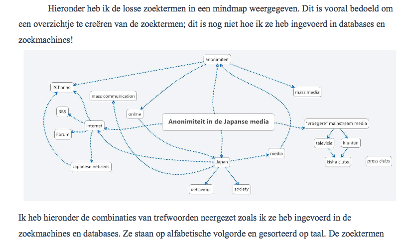

# Search

## zotero

> The power of a good reference manager cannot be understated when writing a thesis or dissertation. 

Alle gevonden bronnen worden vanaf nu georganiseerd met zotero. Problemen die je daarbij ondervindt en vragen die daarbij opborrelen blog je ter voorbereiding van de "citation" sessie van 24/3.

## zoekstrategie

### the art of finding the right keywords - aandacht voor trefwoorden

Zoeken in zoekmachines en databanken staat of valt met de kwaliteit van de gebruikte trefwoorden. Voor je onderzoek zal je doorgaans niet direct de juiste trefwoorden hebben. Ook dit is iets dat moet groeien in de komende weken. 

Uit de individuele oefening moet die evolutie blijken. Maak een mindmap met je trefwoorden (in verschillende talen), blog die (geef aan waarom je bepaalde trefwoorden kiest) en vul regelmatig aan. Hieronder een voorbeeld van een dergelijke mindmap uit [een oefening van vorig jaar](http://japanologie.arts.kuleuven.be/lab/sites/japanologie.arts.kuleuven.be.ijcm13/files/uploads/bijlagen/anonimiteit-massamedia.pdf):

Er zijn heel wat degelijke webservices of applicaties te vinden om een mindmap te maken, [Xmind](http://www.xmind.net/) bijvoorbeeld, of [Freemind](http://freemind.sourceforge.net/wiki/index.php/Main_Page).

Begin met een lijstje trefwoorden bijeen te brainstormen. Zoek met combinaties van die termen. Wanneer je een goed resultaat krijgt kijk dan naar de belangrijkste woorden in dat resultaat en voeg die toe aan je lijst.

### een notitie-strategie hoort daar ook bij

je verzamelt geen bronnen, maar nota's

- zotero
- evernote

Stel je deze vragen: hoe hou je alle nota's overzichtelijk, hoe vind je ze terug wanneer je ze nodig hebt, hoe maak je nota's terwijl je aan het zoeken/lezen bent, hoe helpen nota's je bij het onthouden wat je gelezen hebt, welke gegevens sla je precies op in nota's

### en zo snel mogelijk een outline van je werkstuk 

zodat je notas kan kaderen in een hoofdstuk, paragraaf

### werkmethode

- eerst standaard zoekopdracht met als doel de verkenning van je onderzoeksthema om tot een onderzoeksvraag te komen (= een interessante onderzoekspiste)
- dan verder zoeken via de bibliografie van gevonden bronnen
- zoek naar de autoriteiten op vlak van je onderwerp, probeer de bestaande theoriën en onderzoeksperspectieven te identificeren 
- iteratie: herhaling van de vorige drie stappen: vind nieuwe trefwoorden en zoek daarmee opnieuw
- ook in de toekomst zoeken
- hou rekening met 
    - de filter bubble
    - soorten zoekmachines
    - dus: It's not just Google. Gebruik altijd meerdere zoekmachines tegelijk en
- zoek diep, de beste resultaten staan niet noodzakelijk op de eerste pagina
- gebruik search operators om je zoekresultaten te filteren
- denk eraan dat je verschillende soorten en formaten bronnen nodig zal hebben om je onderzoek te kunnen voeren

## beschrijving van je zoekmethode

Het is niet voldoende om enkel het resultaat van je zoektocht, de bronnen, op te nemen in het werkstuk. De beschrijving van waar en hoe je gezocht heb is even belangrijk. Bekijk een [goed voorbeeld](http://japanologie.arts.kuleuven.be/lab/sites/japanologie.arts.kuleuven.be.ijcm13/files/uploads/bijlagen/YanaVR_boeddhisme%20en%20kapitalisme.pdf) van zo'n beschrijving. 

## Verder lezen 

### Voor je feed-collectie

[John Batelle's Searchblog](http://battellemedia.com/)

### Leestips

- [What Will Search Look Like In Mobile?](http://battellemedia.com/archives/2014/12/search-look-like-mobile.php) verschillen tss search mobile en search web
- [Wolfram|Alpha
Personal Analytics for Facebook](http://www.wolframalpha.com/facebook/)
- [filterbubbel - groepsoefening encyclopedie 2014](https://filterbubbel.github.io/)

### Ter referentie

Neerslag van twee presentaties over heuristiek in het kader van het OPO Geschiedenis van Japan eerder dit academiejaar:

- [Elements of Search](./elements_of_search.md)
- [Crap Detection](./crapdetection.md)

## Opdrachten en oefeningen

- maak een mindmap met trefwoorden voor je onderzoek (cfr. supra)
- doe een eerste verkennende query (verschillende combinaties van trefwoorden, verschillende zoekmachines, cfr. supra) en documenteer
- __de belangrijkste__: deel zoektips, resultaten, belangrijke bronnen, interessante locaties, vragen, problemen etc. via de blog

### Kies uit:

- maak een workflow van feedly naar zotero
- vind een onbetrouwbare webpagina
- vind een bron die niet online staat
- Doe samen met één of meer anderen dezelfde query in Google. Vergelijk de resultaten. Wie een Google account heeft doet de query zowel voor als na inloggen op die account. Doe daarna hetzelfde met de zoekmachine DuckDuckGo. Vergelijk de resultaten met mekaar en daarna met die van Google. En dat vraagt dan om een reflectief blogje natuurlijk. 
- Zoek naar databanken over je onderwerp via standaard zoekmachines, [dit soort dingen bijvoorbeeld](http://www.jaodb.com/db/search.asp).
- Schrijf de zoekstrategie uit die je de komende weken zal volgen. 

