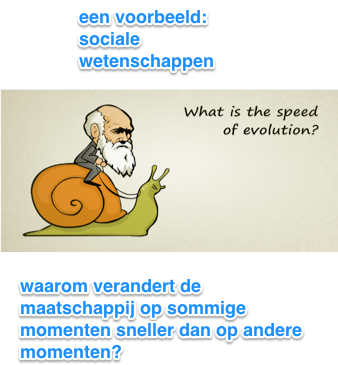

Ency15-5 Writing 1
==================

## Overzicht beoordelingscriteria bachelorpaper Japanologie

## Criteria toegepast in jullie scriptie? 1. Criminaliteit in Japan

## Criteria toegepast in jullie scriptie? 2. Invloedrijke families binnen de politieke geschiedenis van Japan

## Criteria toegepast in jullie scriptie? 3. Vergrijzingspolitiek in Japan

## Criteria toegepast in jullie scriptie? 4. Trans-Pacific Partnership (TPP)

## Methodologie en structuur: een voorbeeld (1) Wat is theorie?

## Methodologie en structuur: een voorbeeld (2) Sociale wetenschappen

## Methodologie en structuur: een voorbeeld (3) Concrete uitwerking en structuur: Punctuated Equilibrium Theory

## Methodologie en structuur: een voorbeeld (4) Sociale wetenschappen - een ander voorbeeld (Agenda Setting Theory)

## Besluit en oefening, oefening, oefening, oefening,….. Writing an Introduction

