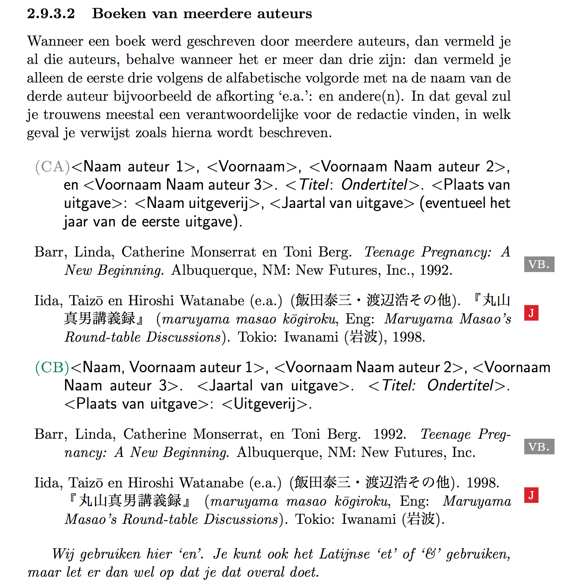
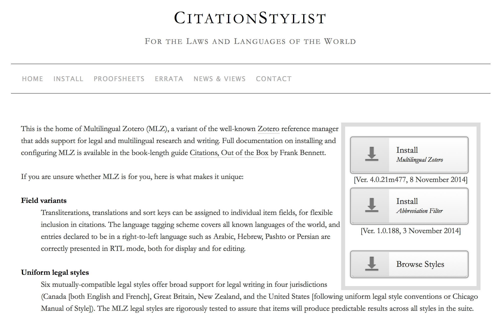
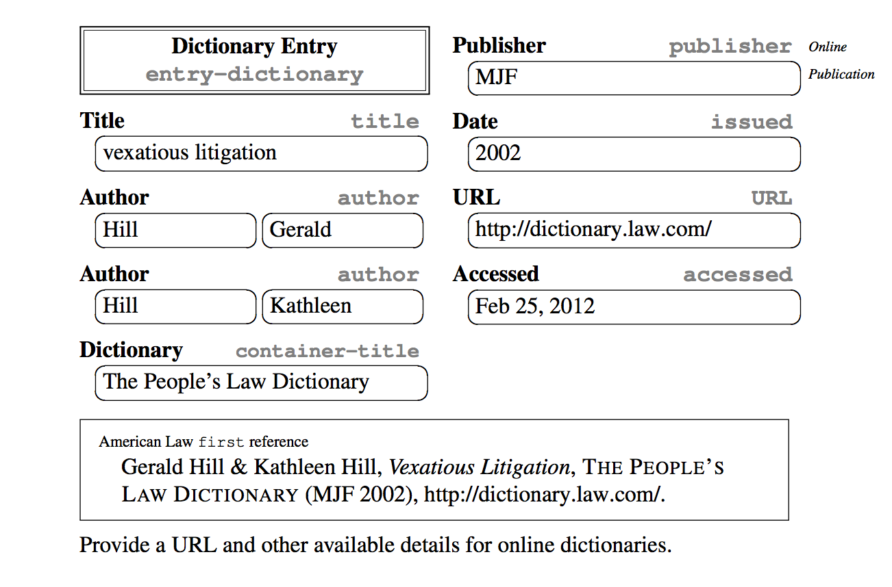
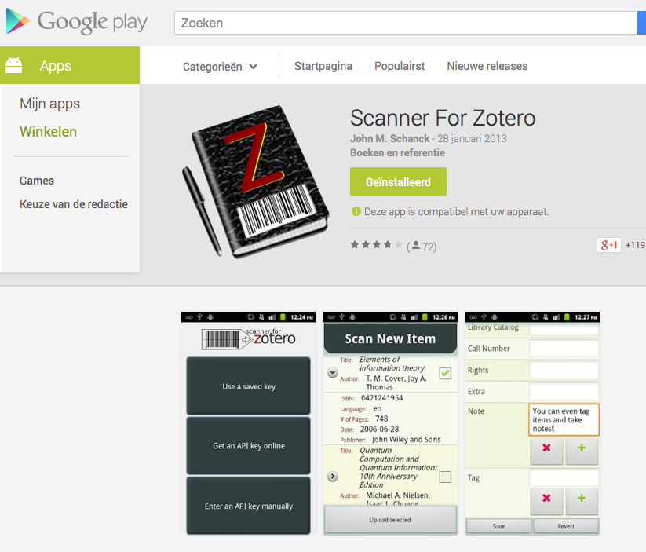

Citation
========

## Dienstmededelingen

- afspraken volgende week: bib en feedback
- ander lokaal na paasvakantie

## Binnengekomen vragen

- Wat met Pdf's in Zotero? Hoe bibliografie hiervan aanmaken?
    + rechts klikken op pdf -- 'retrieve metadata'
    + manueel aanpassen - create parent item, haal de metadata uit het document of url
    + zie ook tip 17
- Welk "type item" is een research report gevonden via Kaken?
    + "Report"?
- Wat indien bepaalde gegevens ontbreken, vb. druk of plaats bij een (e-)book?
    + gegevens via bv. in commerciële catalogi proberen aanvullen
- Valt een interview op Youtube onder de categorie video of interview?
    + interview lijkt me het meest exact
- Mogen of moeten we kanji gebruiken in citatie van Japanse bronnen?
    + moeten

## Kies een verwijzingssysteem 

- Preferences --> Export --> Bibliographical styles
* we hebben een voorkeur voor Chicago A of B
* vermeld die keuze ook in je inleiding van je paper

## Verwijzen naar Japanse bronnen

* voor de meeste courante types bronnen kan je de voorbeelden in de [richtlijnen_verhandeling-3.3](../docs/richtlijnen_verhandeling-3.3.pdf) gebruiken (paragraaf 2.9, vanaf p. 27). Daar wordt per type bron twee voorbeelden in CA en CB gegeven, telkens een Japanse en niet-Japanse bron, bijvoorbeeld:

* types bronnen die je daar niet in vindt, heb je mogelijk wel in 
    * het MLZbook (voor digitale types), cfr infra
    * de Monumenta Niponnica stylesheet (voor klassieke types), cfr. infra
* indien die ook het antwoord niet geven: post je vraag op het bachelorpaper forum of, tijdens #ency15, op het lab

### [MLZ](http://citationstylist.org/)

[youtube intro](http:////www.youtube.com/embed/ociCD7aPEC0?list=UUmBamMlfOhqdESsTtYN96sA)

### MLZ proofsheets
[proofsheets for each Zotero item type in each of the styles in the MLZ family.](http://citationstylist.org/proofsheets/)

### [mlzbook](http://citationstylist.org/public/mlzbook.pdf)

      
Bennett, Frank G. 2013. <i>Citations: Out of the Box</i>.

      

### [Monumenta Nipponica stylesheet](http://monumenta.cc.sophia.ac.jp/MN_Style.html)

Een pdf-bestand dat 31 A4-tjes telt, iets groter dus dan het woord stylesheet doet vermoeden. Het volgt grotendeels de 14e editie van de Chicago Manual of Style en bestaat uit drie delen: algemene richtlijnen (voor het indienen van een artikel ter publicatie), stylistische conventies en een deel over bibliografische verwijzingen.

* Deel 1 doet even glimlachen waar gesproken wordt over Digital (Computer Disk) Versions of Manuscripts, verder is het een behoorlijk droog document dat vooral voor onderzoek waarbij veel Japanse bronnen gebruikt worden waardevol zal blijken.
* Deel 2 behandelt het gebruik van macrons en verbindingstekens naast de correcte weergave van de namen van religieuze instituten, persoonlijke titels, historische periodes, oorlogen, titels van gedichten etc.
* Deel 3 stelt de fijne kantjes van het (hybride) verwijzingssysteem van MN voor. Refereren naar Frequently Cited Series, zenshū, gedichten uit belangrijke bundels… Kortom, alles waar je nooit had kunnen aan denken om te vragen. Het gedeelte over elektronische bronnen is, wel, mager. De richtlijnen toch nog maar niet weggooien.   

## Zotero tips & tricks

1. find duplicates: rechtsklikken library
2. When you have selected an item in the middle column, you can highlight all collections that contain this item by holding down the “Option” key on Mac OS X (=alt), the “Control” key on Windows, or the “Alt” key on Linux.
3. Press ”+” (plus) on the keyboard within the collections list or items list to expand all nodes and ”-” (minus) to collapse them.
4. To see the number of items in the selected library or collection, click an item in the middle column and use the Select All shortcut (Command-A on Mac OS X or Control-A on Windows and Linux). A count will appear in the right column (attachments are included in the count when visible, i.e. when the parent item is expanded).
5. When using Quick Copy (= drag & drop), holding the “Shift” key while dragging and dropping items into a text document will insert citations instead of full references.
6. You can click the DOI and URL field labels to open the field link. To prevent the link to load in the active tab, you can use the standard Firefox shortcut keys for tab/window opening: Ctrl/Cmd-click for a new background tab, Ctrl/Cmd-Shift-click for a new foreground tab, and Shift-click for a new window.
7. Manually adding authors to a Zotero item? You can use Shift+Enter after typing each name as a faster alternative to clicking the ”+” button.
8. Need more than one Zotero library? Use multiple Firefox profiles to keep your libraries separated
9. Enter a series of items by duplicating a template. Adding a series of related references to your library? Start with one item for which you fill in the fields that are the same for all items (e.g. editors, book title, year, publisher, place) and duplicate it (Right-click > Duplicate item). Then fill in the particularities.
10. Quick Copy a citation using Ctrl+Alt+C or drag and drop. Sending a PDF to a colleague, or mentioning a reference somewhere? Quickly copy the citation by selecting the reference and pressing Ctrl+Alt+C (Command+Alt+C on the Mac), or simply drag it from Zotero onto any edit window (for example a new email). The default output style can be specified under Preferences > Export; the shortcut key can be customized under Shortcut keys.
11. Have Zotero index your PDFs. Zotero can index your PDF attachments and make them fully searchable, turning your library from a mere linked catalogue into a Google Books of sorts. The option is turned off by default because it relies on an external open source program (pdf2txt) which is not distributed with Zotero. However, Zotero can automatically install it and enable fulltext indexing: simply go to Preferences > Search and click on the ‘Check for installer’ button. For more info see pdf fulltext indexing in the Zotero documentation.
12. Start quicksearch with ” to trigger advanced search. By default, Zotero starts searching when you put the first few characters in the Search box. In a large library with fulltext indexing enabled, this can be tiresome (you wanted to look for “statistical methods”, but Zotero locks down searching for “st”). To avoid this, simply start your search with ” (double quote) to have Zotero wait until you finish typing and hit enter.
13. Relocate your Zotero folder to a more sensible place. The default place for the Zotero database and attachments in right in your Firefox profile, which isn’t the easiest to locate whichever OS you are on. Go to Preferences > Advanced to customize the storage location. You can place it in a folder that is included in your regular backup schedule or put it on a portable drive so that your library always travels with you (tip: combine it with Firefox Portable, which you can even use without administrator rights).
14. Keep track of recent additions using a saved search. Often you add new items without worrying about tagging or putting them in collections. Click Advanced search, select “Dated Added” > “is in the last” > X “days/months” and fill in the desired period; then save the search. This gives you a dynamically updated overview of your latest additions, so that you can go back to them and do the categorization and tagging work when it suits you.
15. Tag multiple items at once. Want to tag multiple items at once? Select them, make sure the tag selector is visible in the left pane, and drag them onto the tag you want to use. The tag will be applied to all items.
16. Tag incomplete items to find them back and fix them later. Sometimes you know an item has incomplete metadata (e.g. missing page numbers or publisher), but you don’t have the time to fix it right away. Make it a habit to tag such items (“needs metadata”) when you see them. Now you can find them and fix them whenever you have some time to kill.
17. Use a separate folder for files to be ingested. Someone gives you a bunch of PDFs to read; or you download a paper somewhere without having the metadata handy. Make it a habit to save such files in a subfolder /new/ in your Zotero folder. Then once in a while go through that folder. Do a quick search for the title on your favourite repository, grab the metadata, and then drag the PDF from your filemanager onto the reference in Zotero. Much better than having those loose PDFs scattered all over your hard drive (or in your mailbox!) — and it helps you keep track of your reading history too.
18. Display a timeline to visualize your bibliography. Not a feature you’ll use everyday, but a neat one nonetheless: Zotero can display your library, or portions of it, on a timeline. Select a group of references, a tag, or a collection and click ‘Create timeline’ (in the Gear menu). This gives you an overview of the items in time. 
19. [Flickr-foto’s opslaan](http://ictoblog.nl/2015/01/17/handig-zotero-en-flickr) in functie van een presentatie bijvoorbeeld.

Bronnen: [Zotero documentation](http://www.zotero.org/support/tips_and_tricks), [ideophone.org](http://ideophone.org/12-zotero-tips-and-techniques/)

### Verwijzen naar beelden 

[http://blog.cloudfour.com/a-framework-for-discussing-responsive-images-solutions/](http://blog.cloudfour.com/a-framework-for-discussing-responsive-images-solutions/)

Zo verwijs je goed: 

1. Photo of Obama licensed under Creative Commons. [CC BY-NC-SA 2.0](http://creativecommons.org/licenses/by-nc-sa/2.0/deed.en) by [BarackObamaDotCom](http://www.flickr.com/photos/barackobamadotcom/5795228030/)
      

## [scanner for zotero](https://play.google.com/store/apps/details?id=org.ale.scanner.zotero)

 

>Het is niet omdat je software gebruikt om het refereren te vergemakkelijken dat eventuele inconsequenties of onvolledigheden ook de verantwoordelijkheid is van die software. 

## Oefeningen vandaag:

1. Schrijf een tutorial over MKZ: installatie, configuratie, vergelijk de output met die van de standaard Zotero (één per groep)
2. Schrijf een tutorial over hoe je Japanse bronnen aanpast in de standaard Zotero (één per groep)
3. Schrijf een tutorial over hoe je Zotero gebruikt met LIMO of
4. over een ander aspect van Zotero (één per groep) - [Ter inspiratie](http://originalminutemaid.tumblr.com/post/44447302785/databases-die-zotero-niet-direct-ondersteunen)

## Tegen volgende week:

- post een eerste draft van je volledige individuele oefening op het lab tegen uiterlijk zondagavond 29/3. Het formaat is html (blogpost, vergeet geen TOC toe te voegen in dit geval) of pdf (als bijlage bij een blogpost). In het laatste geval zet je een korte abstract in het blogbericht.
- neem daarvoor de　toelichting bij de individuele oefening op Toledo door

